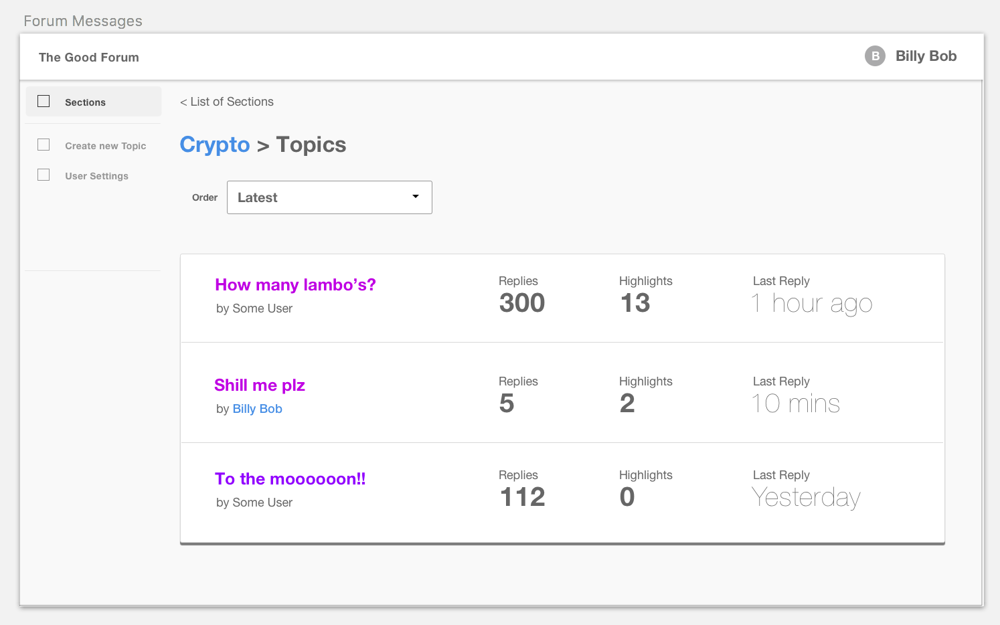

# REX Backend Test

## Overview 

The Good Forum (tm) is an API application built based on [Laravel 5.6](https://laravel.com/).
We would like you to help improve this application by completing the task outlined below.

This API will be utilised by a React frontend. 



### Test Guidelines

* We suggest you spend no more than a few hours on the test.
* Make sure to document your progress and decision making in [this file](docs/test_progress.md)
* Once you've completed you work, please let us know so we can review.

### Problem

We need to be able to sync messages in from an external sources. To demonstrate this issue the `composer dev-setup` command has seeded two sqlite databases.

- database.sqlite is the api database
- database_external.sqlite represents an external data source that we do not control

We anticipate that there will soon be many data sources for messages coming in and need a solution to keep our api database up to date.

### Task

Create a new module to handle syncing data in from the `database_external.sqlite` database and ensuring that `database.sqlite` contains everything.

We need a service that runs and scans the external database (use the laravel connection but don't use eloquent for the external data since in a real situation the data would likely be from a rest api) and copies data back into the main database.

### Considerations

- What is the fastest way to stay sync?
- How will the database stay up to date?
- Will this scale to millions of records?
- How do we know it is correct?

## Installation

### Requirements

- PHP 7.0 (with sqlite)

### Configure

```shell
# install dependencies
composer install

# setup for local dev
#  - copies .env
#  - generates app key
#  - prepares database
composer dev-setup
```

### Run tests

```bash
composer tests
```

### Run application

```bash
php artisan serve
```

Application available from: `http://localhost/`

### Access the API

The API is RESTful:

#### Sections

Sections contain topics. Each section breaks the forum up into logically grouped areas. Eg. the "Crypto" section.

- List of sections: `GET /api/v1/sections`
- Retrieve section: `GET /api/v1/sections/{id}`
- Create a new section: `POST /api/v1/sections`
- Update a section: `PATCH /api/v1/sections/{id}`
- Delete a section: `DELETE /api/v1/sections/{id}`

#### Topics

Topics group together messages within a section.  An example topic in the "Crypto" section might be "I just mortgaged 
my house and now BTC is only worth 3k :scream:".

- List of topics: `GET /api/v1/topics`
- Retrieve topic: `GET /api/v1/topics/{id}`
- Create a new topic: `POST /api/v1/topics`
- Update a topic: `PATCH /api/v1/topics/{id}`
- Delete a topic: `DELETE /api/v1/topics/{id}`
- Get topic thread: `GET /api/v1/topics/{id}/thread`

#### Messages

Messages are created within a topic and may have a parent_id for nested relationships.

- List of messages: `GET /api/v1/messages`
- Retrieve message: `GET /api/v1/messages/{id}`
- Create a new message: `POST /api/v1/messages`
- Update a message: `PATCH /api/v1/messages/{id}`
- Delete a message: `DELETE /api/v1/messages/{id}`

#### Users

Users are the entities within the system that can create messages, and topics.

- List of users: `GET /api/v1/users`
- Retrieve user: `GET /api/v1/users/{id}`
- Create/register a new user: `POST /api/v1/users`
- Update a user: `PATCH /api/v1/users/{id}`
- Delete a user: `DELETE /api/v1/users/{id}`
- Retrieve user profile: `GET /api/v1/users/{id}/profile`
- Update user profile: `PATCH /api/v1/users/{id}/profile`

